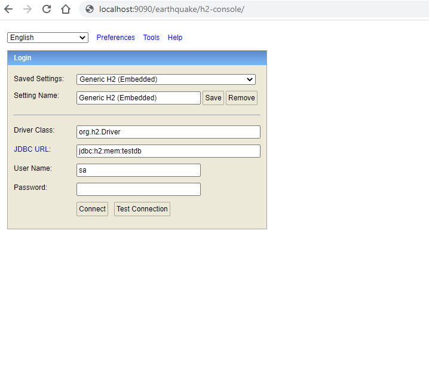
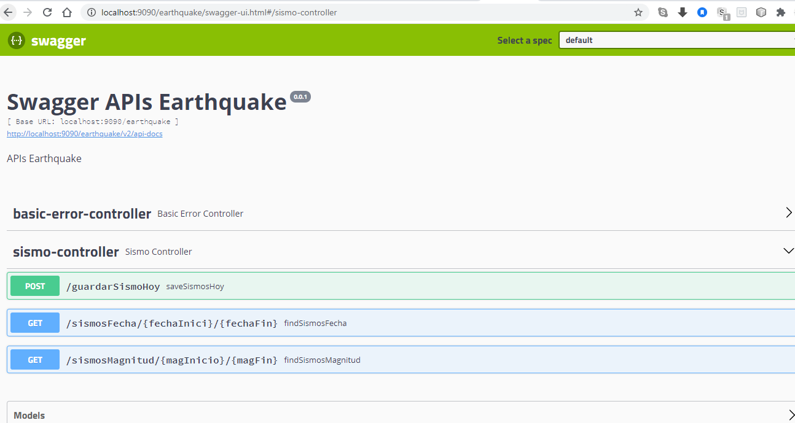

# Prueba Emergya para Ministerio de Educacion

Consumo de ApiRest publica Earthquake Catalog.

## Tecnologias 🚀

Spring Boot, Swagger, Maven, H2, JUnit 4.

## Base de datos H2
Enlace: http://localhost:9090/earthquake/h2-console

## Swagger-UI 
Enlace: http://localhost:9090/earthquake/swagger-ui.html

